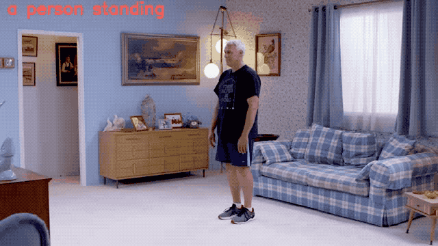

# CLIP Exercise Recognizer

[Colab](https://colab.research.google.com/github/ortizeg/clip-exercise-recognition/blob/main/notebooks/ClipExploration.ipynb) | [Hosted Demo](http://exercise.enriquegortiz.com)

**Demo will only be up for a couple of months.**



This repository contains a simple API for performing exercise recognition on still-images using the [OpenAI CLIP model](https://github.com/openai/CLIP). The demo is built using
- [fastapi](https://github.com/tiangolo/fastapi)
- [streamlit](https://www.streamlit.io/)
- [Docker](https://www.docker.com).

OpenAI, with the release of CLIP, provides the first zero-shot paper that actually works relatively well across many datasets. CLIP is trained on ~20,000 (image, text) pairs across a vast ontology, so it extends easily to other domains without supervision, although it is possible to add a classifier on top of extracted features.

## Goals
1. Exploration
- First explore what does prediction look like on exercise classification.
- Explore how exercise classification performs in a video frame by frame as time-series.

2. Build simple, deployable API for others to explore and expand upon.

## Usage

This workflow is tested on GCP, however it should extend to other cloud providers as it's docker-based. Currently runs in CPU mode, but slight modifications would allow for use with GCP.

1. Install dependencies onto machine, e.g.
``` bash
sudo apt-get install git docker build-essentials
```
2. Clone repository.
3. Build demo server.
``` bash
make serve-cpu
```

## Supported Labels
1. "a person standing"
2. "a person repeating a squat"
3. "a person repeating a jumping jack"
4. "a person performing a plank"

Edit `src/labels.txt` if you want to try other labels in the demo api or edit `texts` variable in the notebook to experiment. Have fun, "prompt engineering" is the new rage :-D.

## Sample Results

### Jupyter Notebook / Colab
In the notebook, I have an example working on video where I run the CLIP model frame by frame with a mean smoothing window size of 5.

### Streamlit


## References
1. https://github.com/openai/CLIP
2. https://openai.com/blog/clip/
